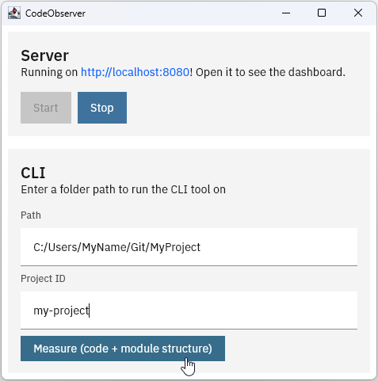

# Installation (standalone)

Standalone installation is the simplest way to get started. It's just a desktop app that contains both the server and
the CLI tools. It can also be used for CI integration if ran on the same machine as a self-hosted GitHub runner.

## Instructions

Install the latest desktop build and run it. After starting it, you can run the server and run some CLI commands
directly from the UI.

