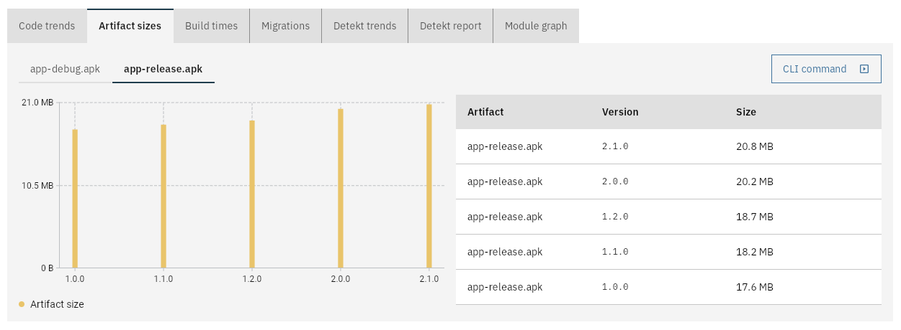

# Artifact sizes

This will measure the passed in artifact's size. The results will be shown in a chart over time:



## With the CLI tool

Run the `measure-artifact-size` command with the following arguments:

| Argument    | Required? | Description                                   |
|-------------|-----------|-----------------------------------------------|
| `--server`  | ✅         | URL of the CodeObserver server                |
| `--project` | ✅         | Name of the project                           |
| `--file`    | ✅         | The artifact to measure                       |
| `--name`    | ✅         | Name of the artifact                          |
| `--semVer`  | ✅         | [SemVer](https://semver.org/) of the artifact |

## With the GitHub Action

```yaml
  -   name: CodeObserver
      uses: jacobras/CodeObserver@v0
      timeout-minutes: 5
      with:
          command: measure-artifact-size --file build/libs/your-project.jar --name your-project.jar --semVer 1.0.0
          server: ${{ secrets.CODEOBSERVER_SERVER_URL }}
          project: your-project
```