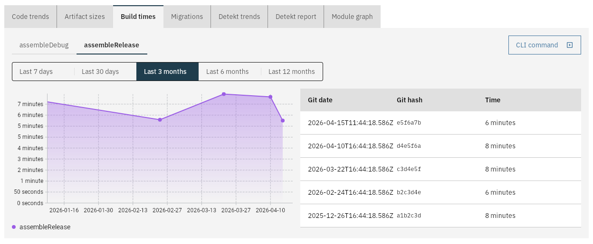

# Build times

This will record the passed in build time. The results will be shown in a chart over time:



## With the CLI tool

Run the `report-build-time` command with the following arguments:

| Argument    | Required? | Description                    |
|-------------|-----------|--------------------------------|
| `--server`  | ✅         | URL of the CodeObserver server |
| `--project` | ✅         | Name of the project            |
| `--name`    | ✅         | Name of the build              |
| `--time`    | ✅         | Build time in seconds          |

## With the GitHub Action

```yaml
  -   name: CodeObserver Artifact Size
      uses: jacobras/CodeObserver@v0
      timeout-minutes: 5
      with:
          command: report-build-time --name clean-build --time 123
          server: ${{ secrets.CODEOBSERVER_SERVER_URL }}
          project: your-project
```