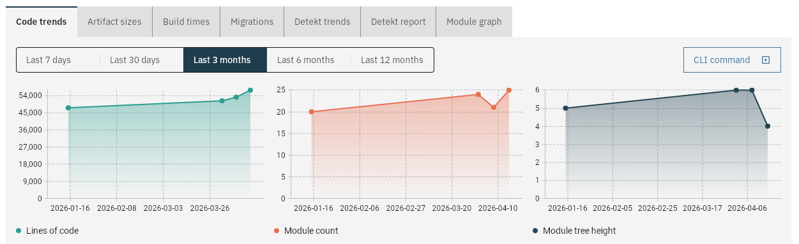

# Code metrics

This will collect:

- Lines of code

And, if the project is a Gradle project:

- Module count
- Module tree height
- Longest path between two modules
- Module graph

And, if [migrations](tech_debt_migrations.md) are configured:

- Number of times an import is used; or
- Number of times a module is used

The results will be shown in charts over time:



## With the CLI tool

Run the `measure` command with the following arguments:

| Argument    | Required? | Description                    |
|-------------|-----------|--------------------------------|
| `--server`  | ✅         | URL of the CodeObserver server |
| `--project` | ✅         | Name of the project            |

The hash and date of the last Git commit will be used to store the results. To backfill older results, check out
an older commit and run the command again.

## With the GitHub Action

```yaml
  -   name: CodeObserver Detekt
      uses: jacobras/CodeObserver@v0
      timeout-minutes: 5
      with:
          command: measure
          server: ${{ secrets.CODEOBSERVER_SERVER_URL }}
          project: your-project
```

The hash and date of the last Git commit will be used to store the results.