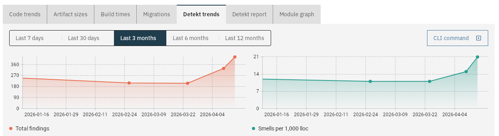
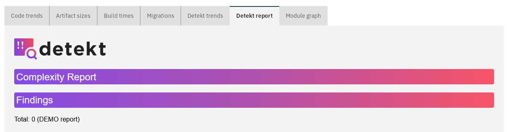

# Detekt metrics

This will collect:

- Total number of findings
- Smells per 1000 LoC
- The full HTML report

from the passed in Detekt HTML report.

The results will be shown in charts over time:



and the full report will be accessible:



## With the CLI tool

Run the `report-detekt` command with the following arguments:

| Argument     | Required? | Description                    |
|--------------|-----------|--------------------------------|
| `--server`   | ✅         | URL of the CodeObserver server |
| `--project`  | ✅         | Name of the project            |
| `--htmlFile` | ✅         | Path to the HTML report        |

The hash and date of the last Git commit will be used to store the results. To backfill older results, check out
an older commit and run the command again.

## With the GitHub Action

After running Detekt, feed the HTML report to CodeObserver:

```yaml
  -   name: CodeObserver Detekt
      uses: jacobras/CodeObserver@v0
      timeout-minutes: 5
      with:
          command: measure
          server: ${{ secrets.CODEOBSERVER_SERVER_URL }}
          project: your-project
```

The hash and date of the last Git commit will be used to store the results.