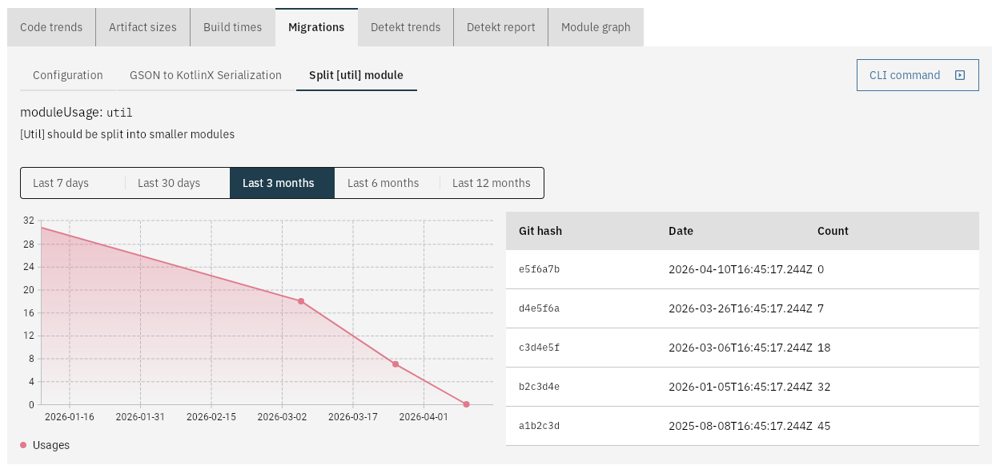

# Tech debt migrations

This will collect:

- Number of times an import is used; or
- Number of times a module is used

Make sure to first configure the migration in the web app.

The results will be shown in charts over time:

The data is collected when the `measure` command is run. See [Code metrics](code_metrics.md) for instructions.